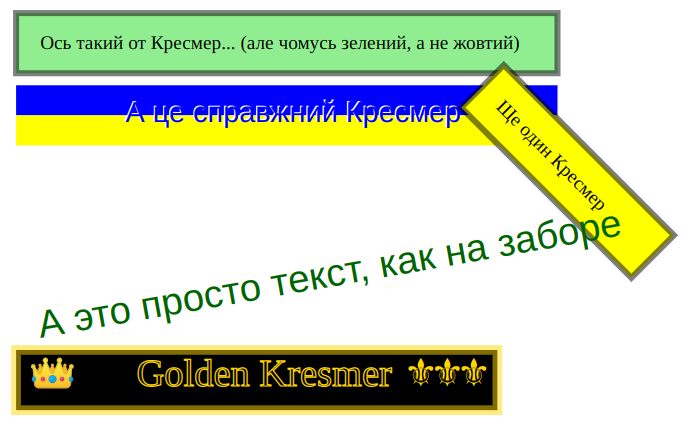

# "Kreslennya Merezh" - network diagram editor and viewer



## Get Started

### 1. clone this repository

```bash
git clone https://github.com/mpolk/kresmer.git
```

### 2. install packages

```bash
npm i
```

### 3. run

```bash
npm run app:dev
```
