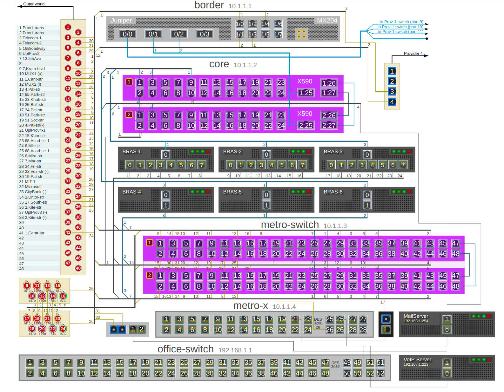

# Kresmer - a network drawing and diagram editor and presentation component

## Overview (what is that Kresmer?)
 
OK, "Kresmer" is yet another graphics editor, but a very specialized one. 
It is designed for one purpose: creating network drawings and diagrams. 
Its target audience is network administrators and engineers who document and illustrate their networks.

Unlike with general-purposes editors, when you use Kresmer you do not build the drawing from the graphical primitives.
You compose your drawing from the parametrized components and each of them represents a real network component (or its part).
If you need to draw two switches (24-port and 48-port) connected with an optical patch-cord (port 5 of the switch A to the port 10 of switch B),
you do not draw to rectangles (for switch bodies), do not paint 24+48 ports on their surfaces and do not draw 5-segment broken line
representing the patch-cord. You even do not place two switch-body templates onto the drawing and then 24+48 port templates onto the
switch templates.

Instead you place two switch components on the canvas and specify that the first switch has 24 ports and the second one has 48. 
Then you connect the 5-th port of the first switch to the 10-th port of the second one with a link of class "single-mode patch-cord". 
Then you add some vertices to the link to make it look better - without worrying about their exact positions, 
Kresmer will take care about their alignment.

If later you will move one of the switches 20 pixels right and 50 pixels down, the patch-cord start- or end-point will 
not be left hanging in midair. The end points of the patch-cord will follow the switch ports they are connected to.

Hope, I have been able to show the difference.

Besides the desktop editor application, Kresmer also includes a web component (also called "kresmer") for publishing Kresmer drawing on the Web.
To distinguish between the desktop application and the web component, the former is sometimes called e-Kresmer (since it is based on Electron).

## Features

- Composing a drawing from the parametrized components, not from the graphical primitives

- Persistent inter-component links (i.e. links, which end-points follow the components they are connected to)

- Link auto-alignment

- End-to-end link highlighting (i.e. hovering the mouse over the link highlights not only the itself but all the other links and the component
  ports this link is connected to, either directly or indirectly)

- Dynamic data binding (i.e. fetching component parameters from the database and modifying the components accordingly)

## Usage scenarios
### Publishing the drawings

Kresmer uses its own drawing file format, which can not be directly read by other applications (at least currently). So you have
the following options to publish you drawings:

- Embed Kresmer web component into the page of your site or web-application and feed the drawing file to this component. This is the best way,
  because it lets you leverage all Kresmer features and capabilities, such as link highlighting, dynamic data binding etc. But you also may find
  this way somewhat complicated, because it requires to use some not-so-trivial front-end technics, such as Typescript compilation and script bundling.
  If you are not afraid of these technics, this is your way.

- You may export you drawing to SVG-format, which is understood by many desktop applications and browsers. At least it should be. Unfortunately 
  Kresmer uses rather advanced the CSS-styling that seems to be too complex for the most of the desktop SVG-editors. Nor Inkscape, nor LibreOffice Draw
  can not render Kresmer SVGs without style degradation. At the same time all modern browsers perfectly render the SVG-graphics generated by Kresmer.

### Authoring the drawings

If you just want to create network drawings using ready components, e-Kresmer desktop application is all you need. Launch it and create!

But if you want to make your own components (and you probably will want, since currently there are not many ready components around) you will need
some more things. You should be familiar with such a technologies as SVG (required), Javascript (recommended) and VueJS (also recommended). 
And finally, you should read the [Kresmer Library Authoring Guide](//github.com/mpolk/kresmer/wiki/Kresmer-Library-Authoring-Guide).
