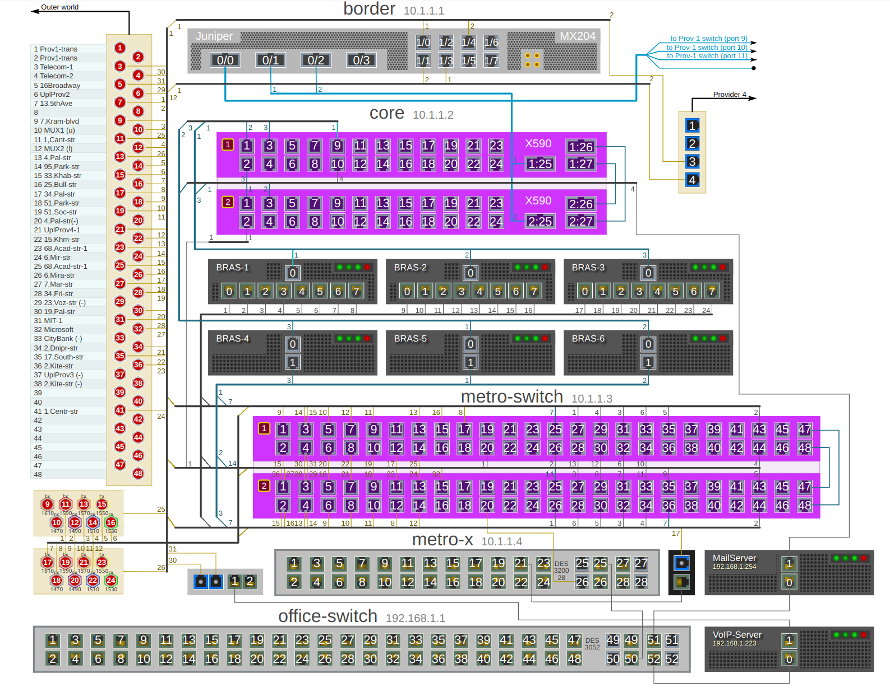

# "Kreslennya Merezh" - network diagram editor and viewer



## Get Started

### 1. clone this repository

```bash
git clone https://github.com/mpolk/kresmer.git
```

### 2. install packages

```bash
npm i
```

### 3. run

```bash
npm run app:dev
```


Other useful commands:
### dev mode

```bash
npm run app:dev  
```

### preview mode

```bash
npm run app:preview  
```

### build app

```bash
npm run app:build
```

### debug main process

1. Add a break point in the main process `src/electron/main/main.ts`.
2. Open the `Run and Debug (Ctrl+Shift+D)` tool, and select `Debug Main Process`.
*Note: Before using the debug tool to debug the main process, you should run the preview script `npm run app:preview` first to build the Vue app.*
